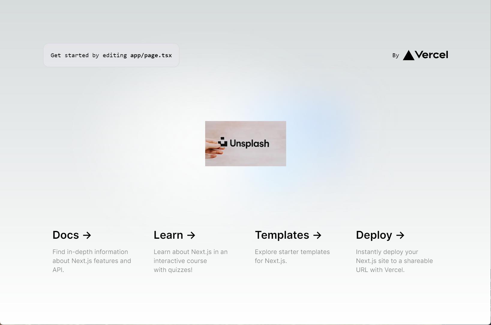

## 소개
이 문서에서는 간단한 `nextjs` 샘플 페이지를 `v0.0.1`, `v0.0.2` 버전으로 도커이미지 빌드 후 첫 배포는 `v0.0.1` 버전으로 배포합니다. 그리고 이 상태에서 `v0.0.2` 버전으로 배포하려 할때 Blue Green, Canary 방식으로 무중단 배포하는 방식에 대해 정리해봅니다. 

`v0.0.1` 버전, `v0.0.2` 버전에 해당하는 이미지는 각각 아래와 같습니다. 

`v0.0.1` 버전

 

`v0.0.2` 버전

 

저는 Backend 개발자이고, Frontend 를 자유자재로 하는 수준은 아닙니다. 굳이 Frontend 를 무중단 배포 예제로 사용한 이유는 무중단배포 결과를 명확히 표현해서 비교하기에는 Frontend 예제가 훨씬 낫겠다는 생각이 들어서 Frontend 예제로 정리했습니다. 
 

