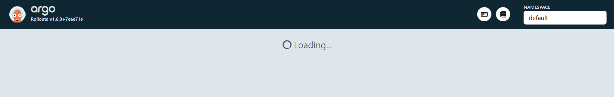

## 13. 클러스터 내에 argo-rollouts 리소스 설치
이번 문서에서는 namespace, `argo-rollouts` 컨트롤러를 설치합니다. 리소스 설치가 완료되면 대시보드를 로드해보고 잘 동작하는지를 접속해봅니다.<br>
<br>

## 참고자료
- [Argo Rollouts - Kubernetes Plugin/Installation](https://argo-rollouts.readthedocs.io/en/stable/features/kubectl-plugin/)
- [Argo Rollouts - Installation](https://argo-rollouts.readthedocs.io/en/stable/installation/)
<br>

## `argo-rollouts` 네임스페이스 추가
```bash
$ kubectl get ns
NAME                 STATUS   AGE
argocd               Active   11h
default              Active   11h
ingress-nginx        Active   11h
kube-node-lease      Active   11h
kube-public          Active   11h
kube-system          Active   11h
local-path-storage   Active   11h
nextjs-example       Active   9h


$ kubectl create namespace argo-rollouts
namespace/argo-rollouts created

$ kubectl get ns
NAME                 STATUS   AGE
argo-rollouts        Active   86m
argocd               Active   12h
default              Active   12h
ingress-nginx        Active   12h
kube-node-lease      Active   12h
kube-public          Active   12h
kube-system          Active   12h
local-path-storage   Active   12h
```
<br>

## 클러스터 내에 argo-rollouts 컨트롤러 설치
```bash
$ kubectl apply -n argo-rollouts -f https://github.com/argoproj/argo-rollouts/releases/latest/download/install.yaml
customresourcedefinition.apiextensions.k8s.io/analysisruns.argoproj.io created
customresourcedefinition.apiextensions.k8s.io/analysistemplates.argoproj.io created
customresourcedefinition.apiextensions.k8s.io/clusteranalysistemplates.argoproj.io created
customresourcedefinition.apiextensions.k8s.io/experiments.argoproj.io created
customresourcedefinition.apiextensions.k8s.io/rollouts.argoproj.io created
serviceaccount/argo-rollouts created
clusterrole.rbac.authorization.k8s.io/argo-rollouts created
clusterrole.rbac.authorization.k8s.io/argo-rollouts-aggregate-to-admin created
clusterrole.rbac.authorization.k8s.io/argo-rollouts-aggregate-to-edit created
clusterrole.rbac.authorization.k8s.io/argo-rollouts-aggregate-to-view created
clusterrolebinding.rbac.authorization.k8s.io/argo-rollouts created
configmap/argo-rollouts-config created
secret/argo-rollouts-notification-secret created
service/argo-rollouts-metrics created
deployment.apps/argo-rollouts created
```
<br>


## argo rollouts dashboard 구동
argo rollouts dashboard 를 구동합니다.
```bash
$ kubectl-argo-rollouts dashboard
time="2024-01-20T19:35:03+09:00" level=info msg="Argo Rollouts Dashboard is now available at http://localhost:3100/rollouts"
```
<br>


