## 14. ArgoCD 에 Project,Repository,Application 셋업


## namespace 추가
배포될 애플리케이션의 namespace를 추가합니다. 이 과정은 굳이 지금 해줄 필요는 없지만, namespace 를 썼는지 안썼는지를 명시하기 위해 정리했습니다.
<br>
```bash
$ kubectl create namespace nextjs-example
namespace/nextjs-example created
```
<br>

## Project 추가
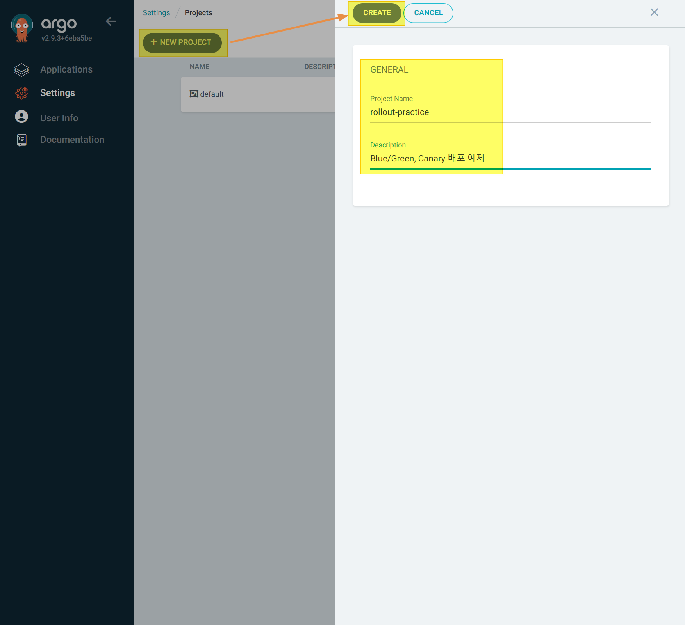
<br>

## Repository 추가
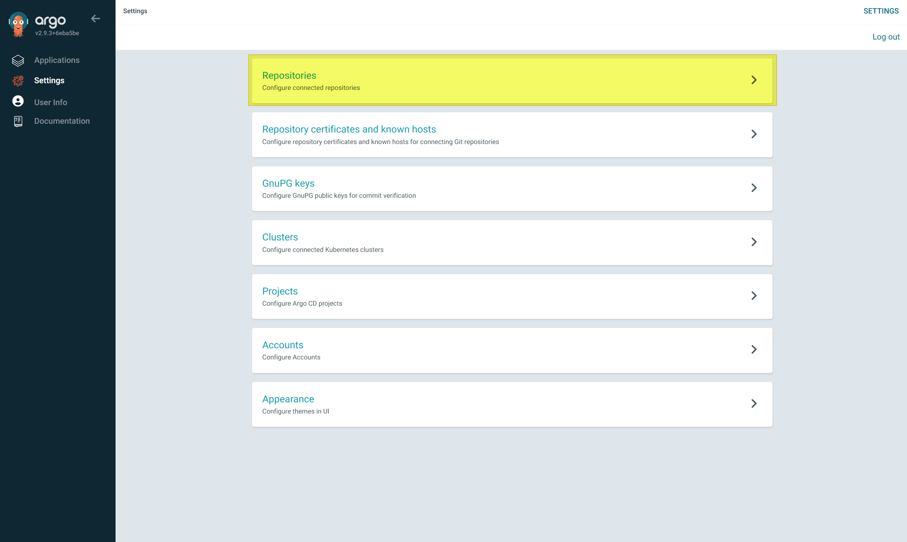
<br>

리포지터리의 http URL 과 github 계정명, access token 을 추가합니다.
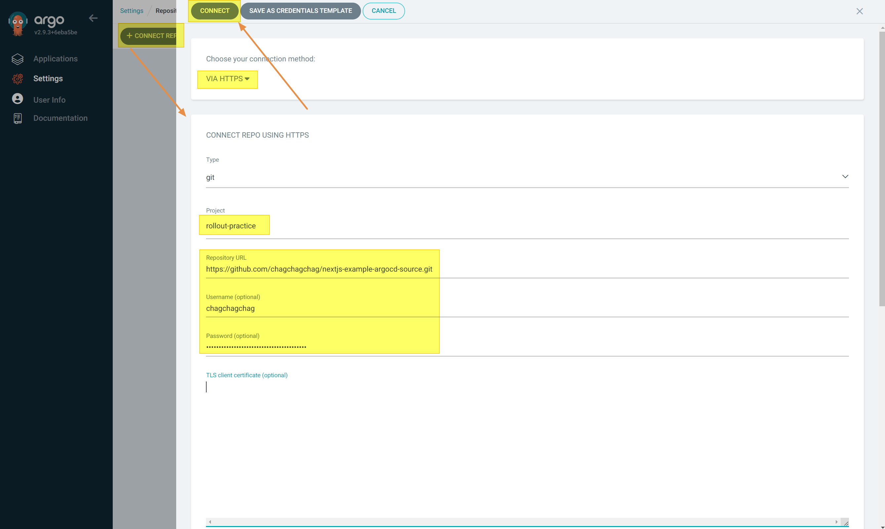
<br>

정상적으로 추가가 완료되면 아래와 같이 CONNECTION STATUS 가 `Successful` 로 나타납니다.
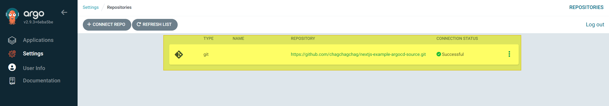
<br>

## Project 에 Repository 연결
방금 ArgoCD에 등록했던 Repository를 Project 에 연결해주는 과정입니다.<br>

Settings → `rollout-practice` 선택
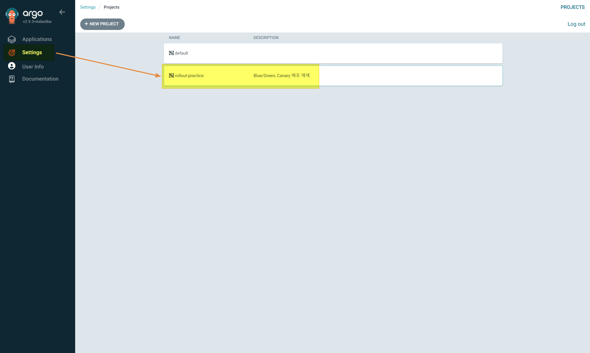
<br>

Source Repository, Distinations 선택
- 모두 이전 스텝에서 만들어두었던 것이고 input 요소를 클릭하면 추천으로 나타납니다.

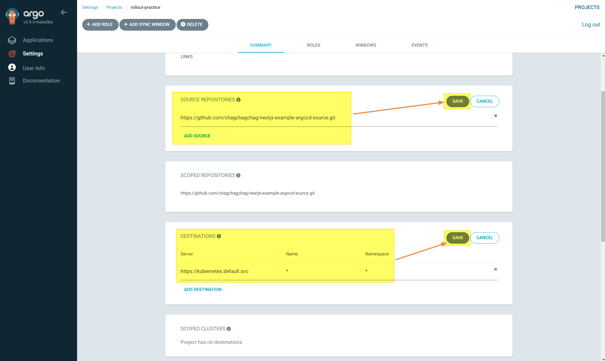
<br>

## Application 생성 
Application → `+NEW APP` 

General 탭에서는 기본적인 정보를 입력합니다.프로젝트는 이전에 추가했던 `rollout-practice` 라는 프로젝트를 선택합니다. Application 에는 원하는 이름을 입력해주는데, `bluegreen` 예제를 작성할 것이기에 `nextjs-example-bluegreen` 을 입력해주었습니다.
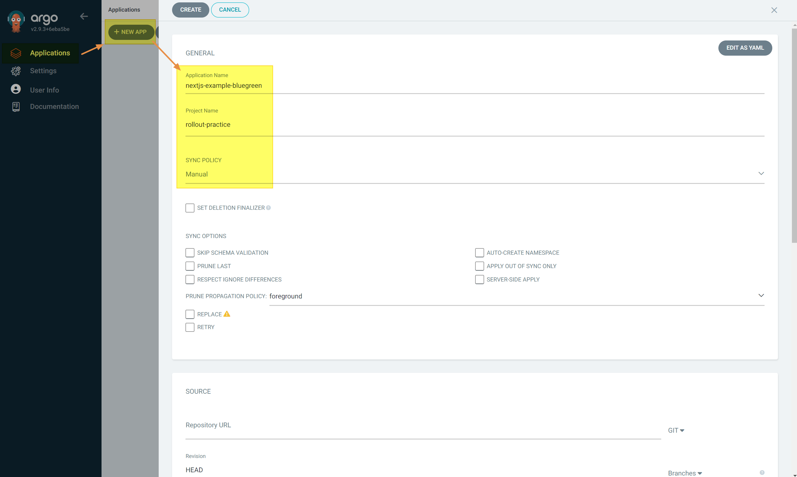
<br>

SOURCE 탭에서는 미리 Repository 로 추가했던 리포지터리를 추가해줍니다.
그리고 Path 는 리포지터리 내의 blue_green 이 위치한 디렉터리를 선택합니다. blue_green 에 rollout 정의를 한 kustomization 이 있기 때문입니다.
<br>
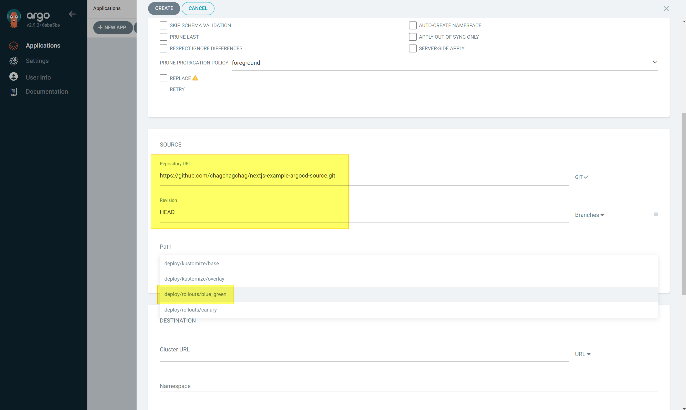
<br>

Destination 에는 아래와 같이 선택해주고, Kustomize 는 기본으로 채워져 있는 그대로 두고 `CREATE` 버튼을 눌러서 Application 생성을 완료합니다.
<br>

<br>

## Sync

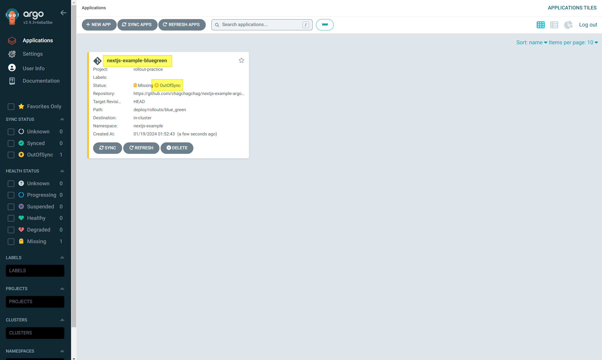
<br>

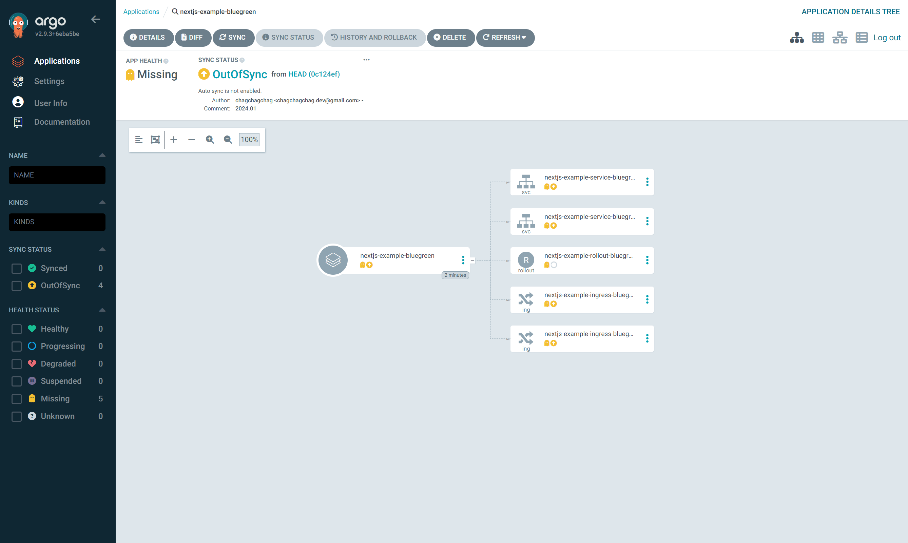
<br>

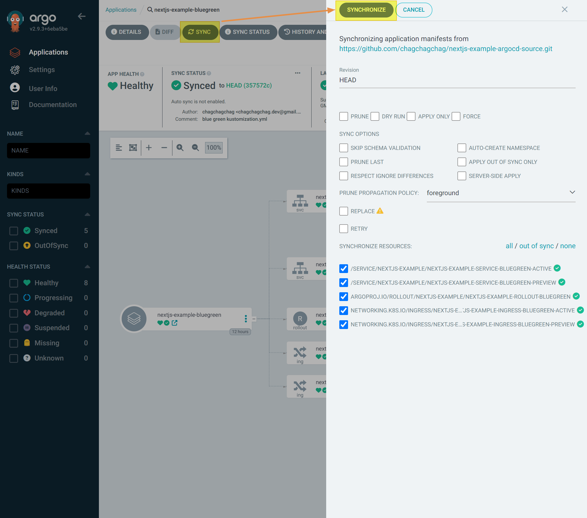
<br>

