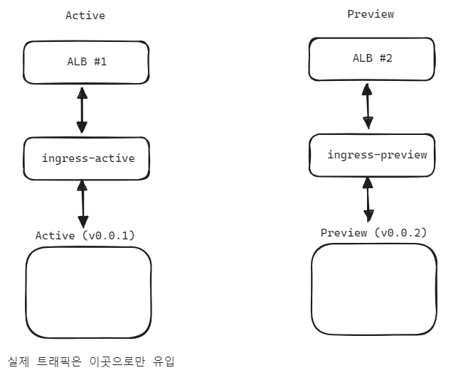
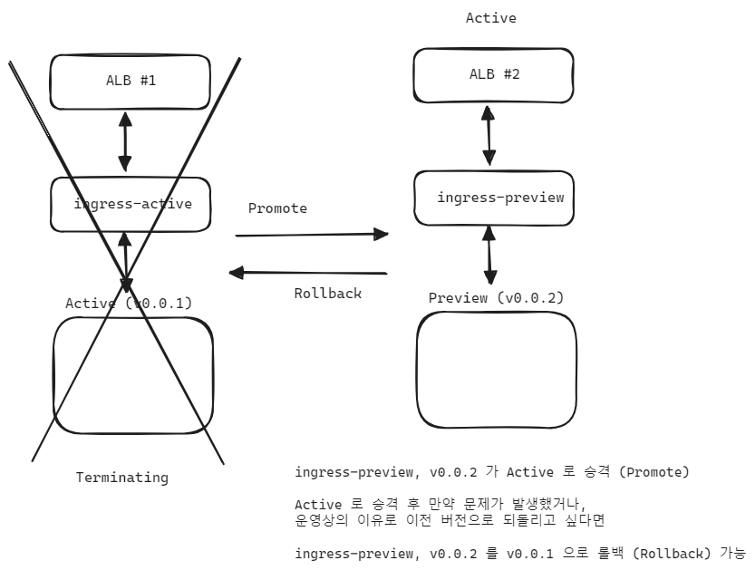
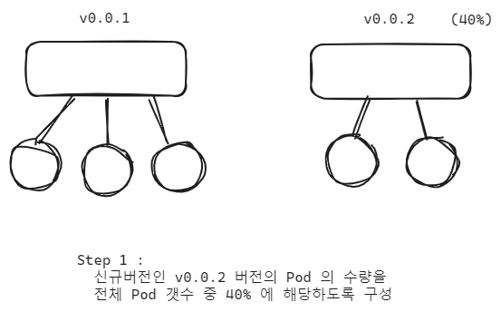
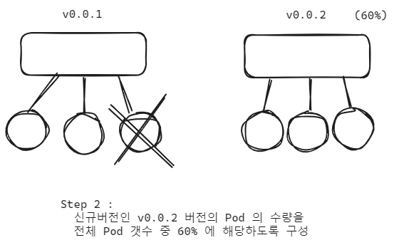
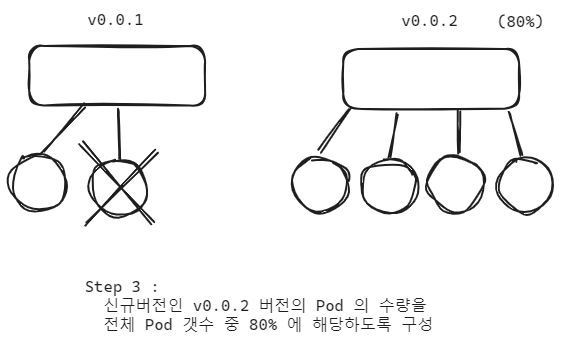
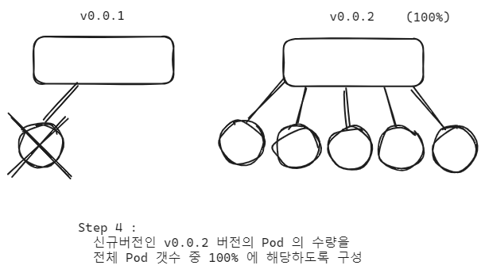

## 3. BlueGreen,Canary 배포개념

## Blue/Green 배포 
블루 그린 배포를 위해서는 제일 처음에는 아래와 같이 현재 `Active` 인 서비스는 그대로 두고 `Preview` 를 하나 더 기동합니다. 만약 EKS와 같은 클라우드 밴더를 사용한다면 ingress 에 매핑되는 ALB 역시도 하나 더 기동됩니다. 

이 때 실제 트래픽은 `Active` 로 유입됩니다. `Preview` 는 현재 대기중인 상태입니다. 

 

이 상태에서 트래픽을 Preview로 향하도록 한순간에 변경시켜주고, 현재 Preview 를 Active 로 승격(Promote) 시켜줍니다. 이때 만약 Active 가 된 새로운 서비스가 문제가 있거나 이전 버전으로 되돌리고 싶다면 다시 예전버전으로 롤백(Rollback)하는 것 역시 가능합니다.

 

## Canary 배포
카나리 배포는 흔히 말하는 `A-B 테스트` 시에 사용됩니다.

step1

 

step2

 

step3

 

step4

 

각 단계로 전환할 때마다 Promote, Rollback 이 모두 가능합니다.

Argo Rollouts 를 사용하면 이와 같은 과정들이 Revision 으로 관리되어서 Revision 단위로 Rollback, Promote 가 가능해집니다. 

여기에 더해서 Argo Rollouts 에서 지원하는 Argo Rollouts Dashboard 기능은 한눈에 현황을 시각적으로 확인 가능하고 `Promote`, `Rollback` 을 GUI 에서 진행이 가능하기에 휴먼 에러를 방지할 수 있습니다. 
 
