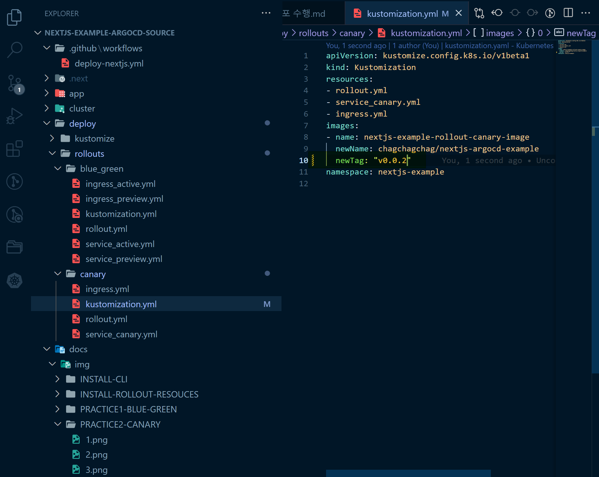

## ArgoCD로 Canary 무중단 배포 수행
Canary 배포는 흔히 말하는 `A-B 테스트`를 해보려고 할 때 사용하는 배포 방식입니다. 자세한 설명은 별도로 정리한 문서를 확인바랍니다.<br>
<br>

## Project,Repository,Application 생성 직후 Rollout 리소스들
이전 챕터에서 정리했던 내용의 결과물은 아래와 같았습니다.

<br>

이번에는 [Rollout 대시보드 (localhost:3100/rollouts)]( http://localhost:3100/rollouts) 에 접속해봅니다.
그리고 현재 상태는 아래와 같이 `Revision 1` 에서 대기 상태이고 아직은 리소스가 모두 로딩된 상태는 아닙니다.<br>
<br>

<br>

## v0.0.1 버전 
[http://localhost:3000](http://localhost:3000) 으로 접속해보면 `v0.0.1` 버전의 결과물은 아래와 같습니다.


<br>

## v0.0.2 버전을 github deploy 리포지터리에 commit & push
아래와 같이 `rollouts/canary/kustomization.yml` 내에 `newTag` 를 `v0.0.2` 로 수정해줍니다.

<br>

그리고 수정한 이 내용들을 git commit, push 를 수행합니다.

```bash
git add .

git commit -m "v0.0.2"

git push -u origin main
```

<br>

## v0.0.2 Synchronize 수행, Step 1, Step2 상태 확인

<br>

새로운 버전인 v0.0.2 가 로딩중인 모습입니다.

<br>

대시보드를 보면 새로운 버전 `v0.0.2` 가 전체 Pod 6기 중 1기가 로딩되어 있습니다.

<br>

[http://localhost:3000](http://localhost:3000) 에 접속해서 결과를 확인해보면, 구버전인 `v0.0.1` 버전은 아주 높은 확률로 나타납니다.
<br>

<br>


반면 `v0.0.2` 버전의 인스턴스는 전체 10% 의 트래픽만 수용하기에 매우 낮은 확률로 아래의 화면이 나타납니다. ([http://localhost:3000](http://localhost:3000))

<br>


## Step 3, Step 4 로 진행. 전체 30% 트래픽을 신규버전 `v0.0.2` 버전으로 유입
이번에는 [Rollout Dashboard (http://localhost:3100/rollouts)](http://localhost:3100/rollouts) 에 접속 후 `Promote` 버튼을 눌러서 다음 단계로 진행합니다.

<br>


카나리 배포가 진행중인 모습입니다. `v0.0.1` 버전으로 배포된 인스턴스 2기는 `Terminating` 되고 `v0.0.2` 버전의 인스턴스 1기를 새로 로딩하고 있습니다.

<br>

ArgoCD 대시보드를 확인해보면 `v0.0.1`버전의 인스턴스는 3기, `v0.0.2` 버전의 인스턴스는 2기가 로딩되어 있습니다. 

<br>

이번에도 `v0.0.1` 버전의 페이지가 높은 확률로 나타납니다.

<br>

이번에는 `v0.0.2` 버전의 페이지는 STEP1 에 비해 더 높은 확률로 조금은 쉽게 나타납니다.

<br>

현재 스텝은 `Step4 Pending`에서 멈춰있는데요. 이 상태에서 유입로그 등을 통해서 어떤 페이지에서 더 어떤 행동을 많이하고 이런 내용들과 사용자 심리를 분석한다거나 하는 과정을 거치게 됩니다.<br>
<Br>

## Step 5, Step 6 으로 진행. 전체 80% 트래픽을 신규버전 `v0.0.2` 버전으로 유입
이번에는 [Rollout Dashboard (http://localhost:3100/rollouts)](http://localhost:3100/rollouts) 에 접속 후 `Promote` 버튼을 눌러서 다음 단계로 진행합니다.

<br>

80% 의 트래픽을 `v0.0.2` 로 보내기 위해 `v0.0.2` 로는 Pod을 하나 더 추가하고 20% 의 트래픽은 `v0.0.1`로 흐르게 하도록 하기 위해 기존 운영중인 인스턴스 2기를 `Terminating` 하고 있습니다.

<br>

`v0.0.1` 버전의 2기의 인스턴스가 종료 중인 모습입니다.

<br>


`v0.0.1` 버전의 2기의 인스턴스의 종료를 완료한 모습입니다.

<br>


이번에는 `v0.0.2` 버전이 굉장히 높은 확률 (80%)로 나타납니다.<br>

<br>

`v0.0.1` 버전의 페이지는 다소 낮은 확률 (20%)로 나타납니다.<br>

<br>

## Step 7, Step 8 - 100% 트래픽을 `v0.0.2` 버전으로 유입

<br>

마지막으로 1기 남은 `v0.0.1` 버전을 `Termninating` 중입니다.

<br>

ArgoCD 대시보드를 보면 `v0.0.1` 버전은 완전히 종료되었음을 확인가능합니다.

<br>

이번에는 모든 인스턴스들이 `v0.0.2` 버전으로 정상 기동되었습니다.

<br>

[http://localhost:3000](http://localhost:3000) 에 접속해보면 항상 아래와 같은 `v0.0.2` 버전의 페이지가 나타나는 것을 확인 가능합니다.

<br>

