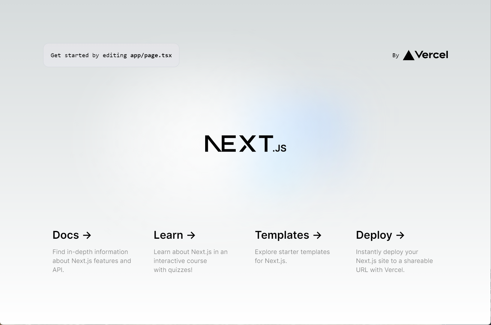
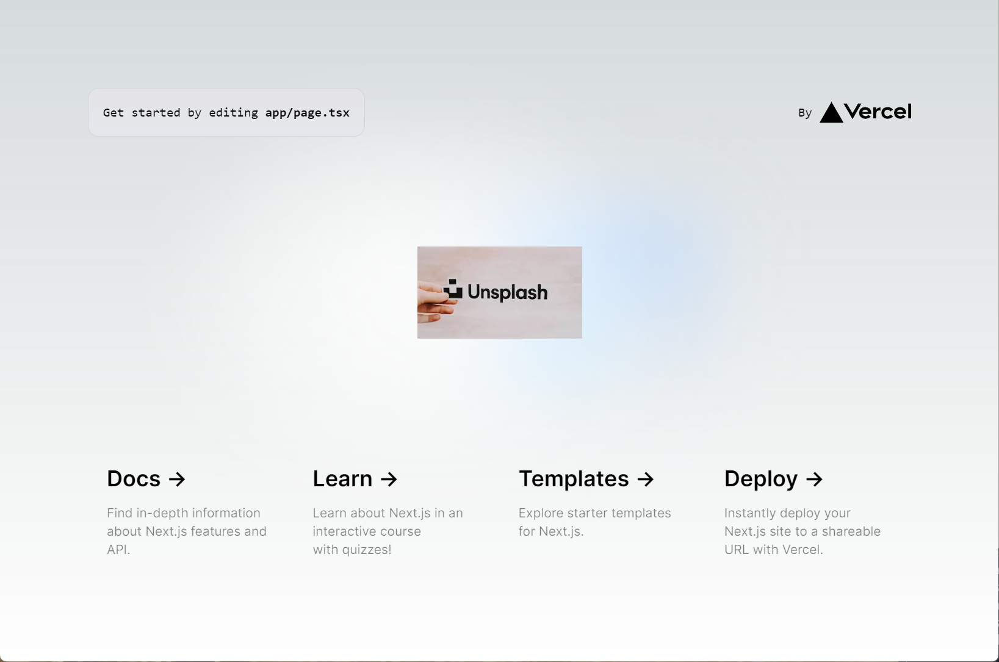

## 구현목표
Before, After 도커 이미지를 각각 만들어 둔 후 Argo Rollouts 를 이용해 Blue/Green 배포 시의 동작, Canary 배포 시의 동작을 각각 확인하는 과정을 **문서화**하는 것이 목표. 
**문서화** ....ㄷㄷ ..................@!?!@@@@@  

### Before

 

### After

